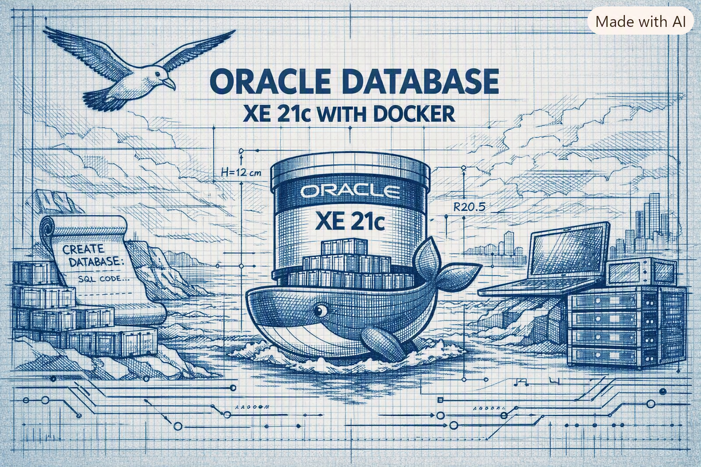

### Oracle Database XE 21c with Docker

> "The only way you can have new sensations is by forging a new soul.
It’s useless to try to feel new things without feeling them in a new
way, and you can’t feel in a new way without changing your soul."<br /><br />"A única maneira de teres sensações novas é construíres-te uma alma nova. Baldado esforço o teu se queres sentir outras coisas sem sentires de outra maneira, e sentires de outra maneira sem mudares de alma."<br/>--- The Book of Disquiet by Fernando Pessoa


#### Prologue 
**M**ost developers don’t like Oracle, and neither do I. Whether one likes it or not, Oracle remains the world’s leading RDBMS. I won't recommend Oracle to anybody though I tackle with it on day to day life. To my understanding, Oracle is too much for most cases and oftentimes `SQLite` just fits in small projects. 

With its steep learning curve and complex management requirements, Oracle is best suited for intermediate to advanced developers. Chances are you need to set up an Oracle environment by yourself, this is where [Oracle Database XE](https://www.oracle.com/database/technologies/appdev/xe.html) comes into play.

**What is Included**

**Multitenant**: Get isolation, agility, and economies of scale by managing multiple Pluggable Databases inside your Oracle Multitenant Container Database

**In-Memory**: Support real-time analytics, business intelligence, and reports by keeping your important data in the Oracle Database In-Memory column store

**Partitioning**: Enhance performance, availability, and manageability of your database with data partitioning that meets diverse business requirements

**Advanced Analytics**: Get valuable insights and deliver predictions from your data using Data Mining SQL, R programming, and the Oracle Data Miner UI

**Advanced Security**: Protect your sensitive data at the source and build end-to-end encrypted apps with layers of security including Oracle Transparent Data Encryption and Data Redaction

**Resources**:

- Up to 12 GB of user data
- Up to 2 GB of database RAM
- Up to 2 CPU threads


#### I. Project Structure 
```
.
├── .env                # Environment variables and credential
├── docker-compose.yml  # Service configuration
├── Makefile            # Automation driver for targets
├── init.sql            # Schema initialization script executed on first boot
├── src/                # Folder for NodeJS sources
└── oracle_data/        # Persistent storage for Oracle XE 21c data
```


#### II. `.env`
```
ORACLE_IMAGE_NAME=gvenzl/oracle-xe:21.3.0
ORACLE_ROOT_PASSWORD=123456
ORACLE_DATABASE=mypdb
ORACLE_CONTAINER_NAME=oracle-db
ORACLE_DATA_DIR=./oracle_data

ORACLE_APP_USER=my_user
ORACLE_APP_USER_PASSWORD=my_password
```

As of this writing, the lastest version is `21.3.0`, there are four image flavors: 
- (default) : Balance image size and functionality. 
- `-slim` : Smaller image size but less functionality.
- `-full` : All functionality provided by Oracle.
- `-faststart` : All functionality with an already expanded and ready to go database inside the image. This image trades image size on disk for a faster database startup time.

*When in doubt, stick to the default*.


#### III. `docker-compose.yml` 
```
services:
  oracle-db:
    image: ${ORACLE_IMAGE_NAME}
    container_name: ${ORACLE_CONTAINER_NAME}
    ports:
      - "${ORACLE_PORT}:1521"
    environment:
      ORACLE_PASSWORD: ${ORACLE_ROOT_PASSWORD}
      ORACLE_DATABASE: ${ORACLE_DATABASE}
      APP_USER: ${ORACLE_APP_USER}
      APP_USER_PASSWORD: ${ORACLE_APP_USER_PASSWORD}
    volumes:
      - ${ORACLE_DATA_DIR}:/opt/oracle/oradata
      # Map your initialization script safely
      - ./init.sql:/container-entrypoint-initdb.d/init.sql:ro
    restart: unless-stopped

    healthcheck:
      test: ["CMD", "healthcheck.sh"]
      interval: 10s
      timeout: 5s
      retries: 10
```

> The image provides a built-in command `createAppUser` to create additional Oracle Database users with standard privileges. The same command is also executed when the `APP_USER` environment variable is specified. If you need just one additional database user for your application, the APP_USER environment variable is the best approach. However, if you need multiple users, you can execute the command for each individual user directly:

```
Usage:
  createAppUser APP_USER APP_USER_PASSWORD [TARGET_PDB]

  APP_USER:          the user name of the new user
  APP_USER_PASSWORD: the password for that user
  TARGET_PDB:        the target pluggable database the user should be created in, default XEPDB1 (ignored for 11g R2)
```

Example: 

```
docker exec <container name|id> createAppUser <your app user> <your app user password> [<your target PDB>]

docker exec oracle-db createAppUser dbconn Pa$$w0rd mypdb
```


#### IV. `Makefile`
```
cnf ?= .env
include $(cnf)
export $(shell sed 's/=.*//' $(cnf))

COMPOSE = docker compose

.PHONY: help up down restart ps logs prune test config

help:
	@echo
	@echo "Usage: make TARGET"
	@echo
	@echo "Oracle Database XE stack automation helper (Linux)"
	@echo
	@echo "Targets:"
	@echo "  up         start all services"
	@echo "  down       stop all services and delete volumes"
	@echo "  restart    restart services"
	@echo "  ps         show running containers"
	@echo "  logs       show logs"
	@echo "  prune      clear data volumes and logs"
	@echo "  test       test if admin (system) connection is online"
	@echo "  test-user  test if app user (my_app_user) can read data"
	@echo "  config     edit configuration"

up:
	@mkdir -p $(ORACLE_DATA_DIR)
	$(COMPOSE) up -d --remove-orphans

down:
	$(COMPOSE) down -v

restart:
	$(COMPOSE) restart

ps:
	$(COMPOSE) ps

logs:
	$(COMPOSE) logs -f

prune:
	@echo "Warning: Clearing data directory and logs..."
	$(COMPOSE) down -v
	@rm -rf $(ORACLE_DATA_DIR) || true

test:
	@echo "Testing Oracle connection via internal healthcheck loop..."
	@if docker exec -i $(ORACLE_CONTAINER_NAME) sh -c \
		'echo "SELECT 1 FROM DUAL;" | sqlplus -S system/$(ORACLE_ROOT_PASSWORD)@//localhost:1521/XE' 2>&1 | grep -q "ORA-"; then \
		echo "❌ Connection failed! Database is still booting up or credentials mismatch."; \
		exit 1; \
	else \
		echo "🎉 Connection successful! Oracle XE is online and ready."; \
	fi

test-user:
	@echo "Testing connection for custom user 'my_app_user' against XEPDB1..."
	@(echo "SET PAGESIZE 50"; echo "SET LINESIZE 120"; echo "COLUMN title FORMAT A35"; echo "SELECT id, title, status FROM todo_list;"; echo "EXIT;") | docker exec -i $(ORACLE_CONTAINER_NAME) sqlplus -S my_app_user/my_secure_password@//localhost:1521/XEPDB1

config:
	nano .env
```


#### V. Let’s get started!
Clone the repositry from [here](https://github.com/Albert0i/XE21c.git) and change into the folder.
```
# 1. Create the persistent database
mkdir -p ./oracle_data 

# 2. Grant read/write ownership directly to Oracle's internal system ID (54321)
sudo chown -R 54321:54321 ./oracle_data
```


#### VI. `init.sql` 
> If you would like to perform additional initialization of the database running in a container, you can add one or more `*.sql`, `*.sql.gz`, `*.sql.zip` or `*.sh` files under `/container-entrypoint-initdb.d` (creating the directory if necessary). After the database setup is completed, these files will be executed automatically in alphabetical order.

> The directory can include sub directories which will be traversed recursively in alphabetical order alongside the files. The container does not give any priority to files or directories, meaning that whatever comes next in alphabetical order will be processed next. If it is a file it will be executed, if it is a directory it will be traversed. To guarantee the order of execution, consider using a clear prefix in your file and directory names like numbers `001_`, `002_`. This will also make it easier for any user to understand which script is supposed to be executed in what order.

> The `*.sql`, `*.sql.gz` and `*.sql.zip` files **will be executed in SQL*Plus as the** `SYS` **user connected to the Oracle instance** (XE). This allows users to modify instance parameters, create new pluggable databases, tablespaces, users and more as part of their initialization scripts. **If you want to initialize your application schema, you first have to connect to that schema inside your initialization script!** Compressed files will be uncompressed on the fly, allowing for e.g. bigger data loading scripts to save space.

> Executable `*.sh` files will be run in a new shell process while non-executable `*.sh` files (files that do not have the Linux executable permission set) will be sourced into the current shell process. The main difference between these methods is that sourced shell scripts can influence the environment of the current process and should generally be avoided. However, sourcing scripts allows for execution of these scripts even if the executable flag is not set for the files containing them. This basically avoids the "why did my script not get executed" confusion.

> **Note**: scripts in `/container-entrypoint-initdb.d` are only run the first time the database is initialized; any pre-existing database will be left untouched on container startup.

> **Note**: you can also put files under the `/docker-entrypoint-initdb.d` directory. This is kept for backwards compatibility with other widely used container images but should generally be avoided. Do not put files under `/container-entrypoint-initdb.d` and `/docker-entrypoint-initdb.d` as this would cause the same files to be executed twice!

> **Warning**: if a command within the sourced `/container-entrypoint-initdb.d` scripts fails, it will cause the main entrypoint script to exit and stop the container. It also may leave the database in an incomplete initialized state. Make sure that shell scripts handle error situations gracefully and ideally do not source them!

> **Warning**: do not exit executable `/container-entrypoint-initdb.d` scripts with a non-zero value (using e.g. `exit 1`;) unless it is desired for a container to be stopped! A non-zero return value will tell the main entrypoint script that something has gone wrong and that the container should be stopped.

**Example**: 

```
-- 
-- ALTER SESSION to use the default pluggable database context.
-- Oracle XE
-- For 18c and onwards, the user will be created in the default `XEPDB1`  pluggable database.
ALTER SESSION SET CONTAINER = XEPDB1;

-- 1. Create a custom application user profile
CREATE USER my_test_user IDENTIFIED BY my_secure_password;

-- 2. Grant necessary development permissions
GRANT CONNECT, RESOURCE, CREATE VIEW TO my_test_user;

-- 3. Set unlimited storage space allocation for the user on the default tablespace
ALTER USER my_test_user QUOTA UNLIMITED ON USERS;

-- 4. Create a sample table under the new user schema context
CREATE TABLE my_test_user.todo_list (
    id          NUMBER GENERATED BY DEFAULT AS IDENTITY PRIMARY KEY,
    title       VARCHAR2(100) NOT NULL,
    status      VARCHAR2(20) DEFAULT 'PENDING',
    created_at  TIMESTAMP DEFAULT CURRENT_TIMESTAMP
);

-- 5. Insert initial seed sample records (12 total rows)
INSERT INTO my_test_user.todo_list (title) VALUES ('Fix the quantum interference device broken by Stuart Bloom');
INSERT INTO my_test_user.todo_list (title) VALUES ('Escape the repressive AI on the idyllic version of Earth');
INSERT INTO my_test_user.todo_list (title) VALUES ('Enlist a powerful wizard to help Bert find a sorcery gift');
INSERT INTO my_test_user.todo_list (title) VALUES ('Survive the post-apocalyptic Pasadena and avoid giant moths');
INSERT INTO my_test_user.todo_list (title) VALUES ('Barter canned vegetables and cat food for rare comic books');
INSERT INTO my_test_user.todo_list (title) VALUES ('Overthrow military dictator Barry Kripke in alternate reality');
INSERT INTO my_test_user.todo_list (title) VALUES ('Locate Denise after she mysteriously disappears in the multiverse');
INSERT INTO my_test_user.todo_list (title) VALUES ('Convince doctors in the mental institution that the multiverse is real');
INSERT INTO my_test_user.todo_list (title) VALUES ('Break out of the Matrix pods before reality resets again');
INSERT INTO my_test_user.todo_list (title) VALUES ('Undo the multiverse Armageddon accidentally unleashed by the gang');
INSERT INTO my_test_user.todo_list (title) VALUES ('Help Gary secure his new job working for UPS');
INSERT INTO my_test_user.todo_list (title) VALUES ('Find the original universe where Leonard and Sheldon live');

COMMIT;
```


#### VII. Loading sample data
Typically speaking, only Oracle experts prefer using SQLPlus... 


`runSqlPlus.js`
```
import 'dotenv/config';
import { spawn } from "child_process";
import dotenv from "dotenv";

// Pick which user you want to connect with
// const user = process.env.ORACLE_APP_USER;
// const password = process.env.ORACLE_APP_USER_PASSWORD;
const user = 'SYSTEM'; 
const password = process.env.ORACLE_ROOT_PASSWORD;

const host = process.env.ORACLE_HOST || 'localhost'; 
const port = process.env.ORACLE_PORT || 1521; 
const database = process.env.ORACLE_DATABASE || 'XEPDB1';

// Build connection string command
const conn = `${user}/${password}@${host}:${port}/${database}`;

// sqlplus <connection string>
console.log(`Launching SQL*Plus with: '${conn}'`);

const sqlplus = spawn("sqlplus", [conn], { stdio: "inherit" });

sqlplus.on("exit", (code) => {
  console.log(`SQL*Plus exited with code ${code}`);
});

```


#### VIII. Test connection
`testConn.js` 
```
import 'dotenv/config'
import oracledb from 'oracledb';
import { createDbConfig } from './config/dbConfig.js';
import { createRunner } from './yrunner.js';

oracledb.outFormat = oracledb.OUT_FORMAT_OBJECT;

const testConnection = async (config) => {
  const runner = createRunner(config);
  try {
    const result = await runner.runSelectSQL(
      "SELECT sys_context('USERENV','DB_NAME') AS db_name, user AS current_user FROM dual"
    );
    if (result.success) {
      console.log(`Connection OK:`, result.rows[0]);

      const banner = await runner.runSelectSQL(
        "select banner from v$version"
      )
      console.log(banner.rows[0].BANNER);
    } else {
      console.error(`Connection FAILED:`, result.message);
    }
  } catch (err) {
    console.error(`$Connection ERROR:`, err);
  }
};
const host = process.env.ORACLE_HOST || 'localhost'; 
const port = process.env.ORACLE_PORT || 1521; 
const database = process.env.ORACLE_DATABASE || 'XEPDB1';

const config = createDbConfig({
  user: process.env.ORACLE_APP_USER,
  password: process.env.ORACLE_APP_USER_PASSWORD,
  // oracle-dev-scan/pdbdev_srv
  connectString: `${host}:${port}/${database}`
});

(async () => {
  // Show Oracle connections
  console.log('conig =', config)
  await testConnection(config);
})();
```


#### IX. Summary
Oracle 21c is a little stale, to be honest, my department is still using 19c! The good news is *All discussion so far also works for 23ai and 26ai*. 

> **Oracle Database 23ai and 26ai are not separate product lines — 26ai is the renamed and enhanced continuation of 23ai**. In October 2025, Oracle rebranded 23ai as **Oracle AI Database 26ai**, with the internal build number `23.26.x`. The relationship is essentially: **23ai laid the foundation, 26ai consolidated and expanded it into a long‑term AI‑native platform**.

If you want to test drive XE 21c and do not have Docker environment, XE 21c installer is available on Windows 11 and Linux platform. As of 23ai, only available on Linux.  




#### X. Bibliography
1. [gvenzl/oracle-xe](https://hub.docker.com/r/gvenzl/oracle-xe)
2. [gvenzl/oracle-free](https://hub.docker.com/r/gvenzl/oracle-free)
3. [Oracle AI Database Free](https://www.oracle.com/database/free/)
4. [Oracle Instant Client Downloads](https://www.oracle.com/database/technologies/instant-client/downloads.html)
5. [SQL*Plus® User's Guide and Reference](https://docs.oracle.com/en/database/oracle/oracle-database/21/sqpug/index.html)
6. [DBeaver Community 26.1.4](https://dbeaver.io/download/)
7. [Sample database of employee table on ORACLE 21c](https://download.oracle.com/oll/tutorials/DBXETutorial/html/module2/les02_load_data_sql.htm)
8. [Oracle Database XE Downloads](https://www.oracle.com/database/technologies/express-edition-downloads.html)
9. [Oracle AI Database 26ai Download for Linux (Intel x86-64) (64-bit)](https://www.oracle.com/database/technologies/oracle26ai-linux-downloads.html)
10. [node-oracledb](https://www.npmjs.com/package/oracledb)
11. [Text Art](https://fsymbols.com/text-art/)
12. [The Book of Disquiet by Fernando Pessoa](doc/The%20Book%20of%20Disquiet%20-%20Fernando%20Pessoa.pdf)


#### Epilogue 
> "For things are what we feel they are – how long have you known
this without yet knowing it? – and the only way for there to be new
things, for us to feel new things, is for there to be some novelty in
how we feel them."

> "Porque as coisas são como nós as sentimos — há quanto tempo sabes tu isto sem o saberes’? — e o único modo de haver coisas novas, de sentir coisas novas é haver novidade no senti-las."


### EOF (2026/08/28)
