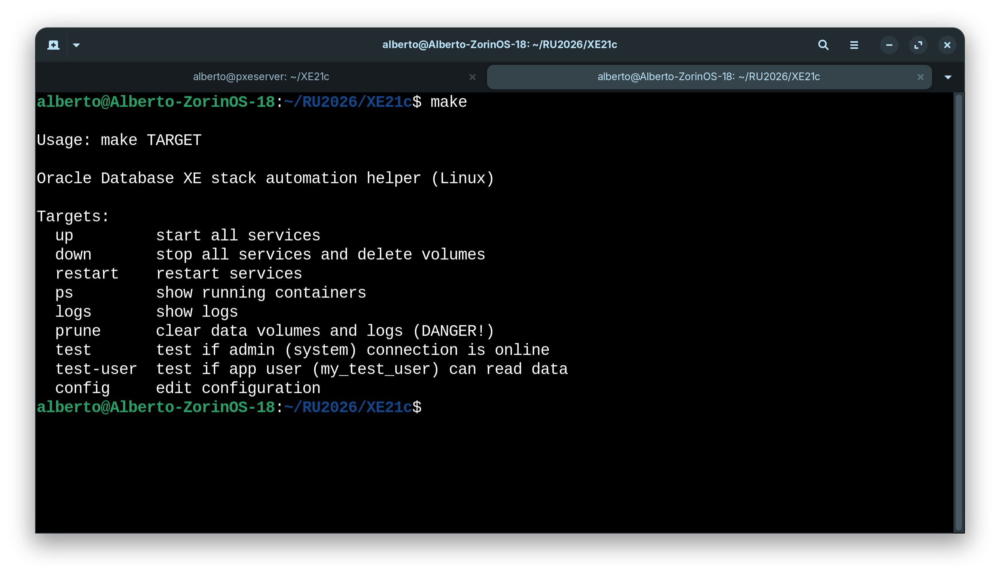
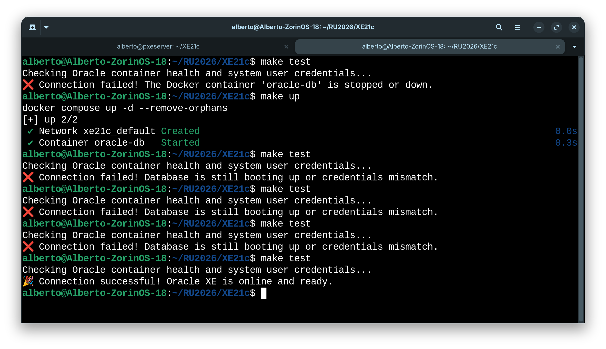
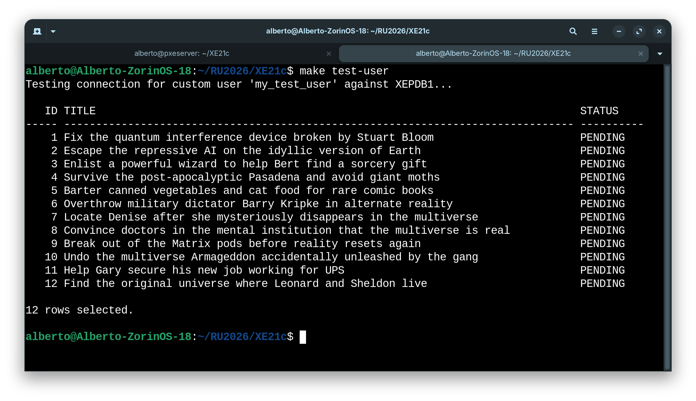
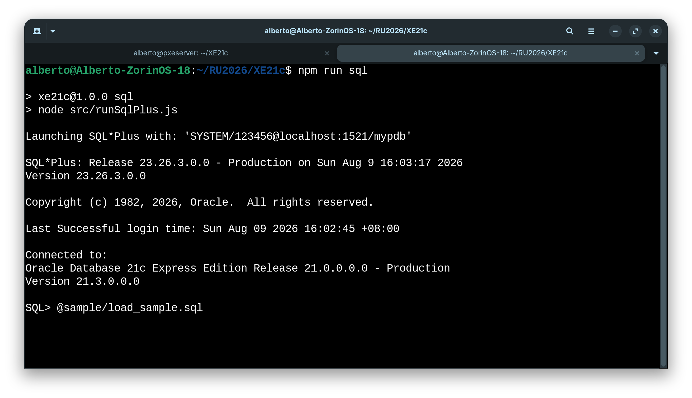
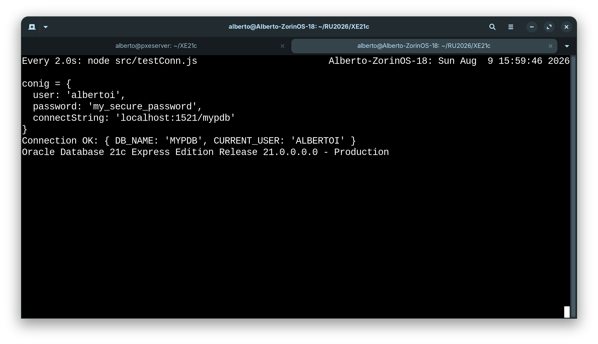

### Oracle Database XE 21c with Docker


#### Prologue 
**M**ost developers don’t like Oracle, and neither do I. Whether one likes it or not, Oracle remains the world’s leading RDBMS. My first choice of relational database is `MariaDB` even I tackle with Oracle on day to day life. To my understanding, Oracle is too much for most cases and oftentimes `SQLite` just fits in small projects. 

With its steep learning curve and complex management requirements, Oracle is best suited for intermediate to advanced developers. Chances are we need to set up an Oracle environment on demand, this is where [Oracle Database XE](https://www.oracle.com/database/technologies/appdev/xe.html) 21c comes into play.

**What is Included**

**Multitenant**: Get isolation, agility, and economies of scale by managing multiple Pluggable Databases inside your Oracle Multitenant Container Database

**In-Memory**: Support real-time analytics, business intelligence, and reports by keeping your important data in the Oracle Database In-Memory column store

**Partitioning**: Enhance performance, availability, and manageability of your database with data partitioning that meets diverse business requirements

**Advanced Analytics**: Get valuable insights and deliver predictions from your data using Data Mining SQL, R programming, and the Oracle Data Miner UI

**Advanced Security**: Protect your sensitive data at the source and build end-to-end encrypted apps with layers of security including Oracle Transparent Data Encryption and Data Redaction

**Resources**:

- Up to 12 GB of user data
- Up to 2 GB of database RAM
- Up to 2 CPU threads


#### I. Project Structure 
```
.
├── .env                # Environment variables and credential
├── docker-compose.yml  # Service configuration
├── Makefile            # Automation driver for targets
├── init.sql            # Schema initialization script executed on first boot
└── oracle_data/        # Persistent storage for Oracle XE 21c data
```


#### II. `.env`
```
ORACLE_IMAGE_NAME=gvenzl/oracle-xe:21.3.0
ORACLE_ROOT_PASSWORD=123456
ORACLE_DATABASE=mypdb
ORACLE_CONTAINER_NAME=oracle-db
ORACLE_DATA_DIR=./oracle_data

ORACLE_APP_USER=my_user
ORACLE_APP_USER_PASSWORD=my_password
```

As of this writing, the lastest version is `21.3.0`, there are three image flavors: 
- (default) : Balance image size and functionality. 
- `-slim` : Smaller image size but less functionality.
- `-full` : All functionality provided by Oracle.
- `-faststart` : All functionality with an already expanded and ready to go database inside the image. This image trades image size on disk for a faster database startup time.


#### III. `docker-compose.yml` 
```
services:
  oracle-db:
    image: ${ORACLE_IMAGE_NAME}
    container_name: ${ORACLE_CONTAINER_NAME}
    ports:
      - "${ORACLE_PORT}:1521"
    environment:
      ORACLE_PASSWORD: ${ORACLE_ROOT_PASSWORD}
      ORACLE_DATABASE: ${ORACLE_DATABASE}
      APP_USER: ${ORACLE_APP_USER}
      APP_USER_PASSWORD: ${ORACLE_APP_USER_PASSWORD}
    volumes:
      - ${ORACLE_DATA_DIR}:/opt/oracle/oradata
      # Map your initialization script safely
      - ./init.sql:/container-entrypoint-initdb.d/init.sql:ro
    restart: unless-stopped

    healthcheck:
      test: ["CMD", "healthcheck.sh"]
      interval: 10s
      timeout: 5s
      retries: 10
```


#### IV. `Makefile`
```
cnf ?= .env
include $(cnf)
export $(shell sed 's/=.*//' $(cnf))

COMPOSE = docker compose

.PHONY: help up down restart ps logs prune test config

help:
	@echo
	@echo "Usage: make TARGET"
	@echo
	@echo "Oracle Database Express Edition (XE) stack automation helper (Linux)"
	@echo
	@echo "Targets:"
	@echo "  up         start all services"
	@echo "  down       stop all services and delete volumes"
	@echo "  restart    restart services"
	@echo "  ps         show running containers"
	@echo "  logs       show logs"
	@echo "  prune      clear data volumes and logs"
	@echo "  test       test if admin (system) connection is online"
	@echo "  test-user  test if app user (my_app_user) can read data"
	@echo "  config     edit configuration"

up:
	@mkdir -p $(ORACLE_DATA_DIR)
	$(COMPOSE) up -d --remove-orphans

down:
	$(COMPOSE) down -v

restart:
	$(COMPOSE) restart

ps:
	$(COMPOSE) ps

logs:
	$(COMPOSE) logs -f

prune:
	@echo "Warning: Clearing data directory and logs..."
	$(COMPOSE) down -v
	@rm -rf $(ORACLE_DATA_DIR) || true

test:
	@echo "Testing Oracle connection via internal healthcheck loop..."
	@if docker exec -i $(ORACLE_CONTAINER_NAME) sh -c \
		'echo "SELECT 1 FROM DUAL;" | sqlplus -S system/$(ORACLE_ROOT_PASSWORD)@//localhost:1521/XE' 2>&1 | grep -q "ORA-"; then \
		echo "❌ Connection failed! Database is still booting up or credentials mismatch."; \
		exit 1; \
	else \
		echo "🎉 Connection successful! Oracle XE is online and ready."; \
	fi

test-user:
	@echo "Testing connection for custom user 'my_app_user' against XEPDB1..."
	@(echo "SET PAGESIZE 50"; echo "SET LINESIZE 120"; echo "COLUMN title FORMAT A35"; echo "SELECT id, title, status FROM todo_list;"; echo "EXIT;") | docker exec -i $(ORACLE_CONTAINER_NAME) sqlplus -S my_app_user/my_secure_password@//localhost:1521/XEPDB1

config:
	nano .env
```


#### V. Let’s get started!







#### VI. `init.sql` 
```
-- 
-- ALTER SESSION to use the default pluggable database context.
-- Oracle XE
-- For 18c and onwards, the user will be created in the default `XEPDB1`  pluggable database.
ALTER SESSION SET CONTAINER = XEPDB1;
-- Oracle Free
-- For 18c and onwards, the user will be created in the default `FREEPDB1` pluggable database. 
-- ALTER SESSION SET CONTAINER = FREEPDB1;
--

-- 1. Create a custom application user profile
CREATE USER my_test_user IDENTIFIED BY my_secure_password;

-- 2. Grant necessary development permissions
GRANT CONNECT, RESOURCE, CREATE VIEW TO my_test_user;

-- 3. Set unlimited storage space allocation for the user on the default tablespace
ALTER USER my_test_user QUOTA UNLIMITED ON USERS;

-- 4. Create a sample table under the new user schema context
CREATE TABLE my_test_user.todo_list (
    id          NUMBER GENERATED BY DEFAULT AS IDENTITY PRIMARY KEY,
    title       VARCHAR2(100) NOT NULL,
    status      VARCHAR2(20) DEFAULT 'PENDING',
    created_at  TIMESTAMP DEFAULT CURRENT_TIMESTAMP
);

-- 5. Insert initial seed sample records (12 total rows)
INSERT INTO my_test_user.todo_list (title) VALUES ('Fix the quantum interference device broken by Stuart Bloom');
INSERT INTO my_test_user.todo_list (title) VALUES ('Escape the repressive AI on the idyllic version of Earth');
INSERT INTO my_test_user.todo_list (title) VALUES ('Enlist a powerful wizard to help Bert find a sorcery gift');
INSERT INTO my_test_user.todo_list (title) VALUES ('Survive the post-apocalyptic Pasadena and avoid giant moths');
INSERT INTO my_test_user.todo_list (title) VALUES ('Barter canned vegetables and cat food for rare comic books');
INSERT INTO my_test_user.todo_list (title) VALUES ('Overthrow military dictator Barry Kripke in alternate reality');
INSERT INTO my_test_user.todo_list (title) VALUES ('Locate Denise after she mysteriously disappears in the multiverse');
INSERT INTO my_test_user.todo_list (title) VALUES ('Convince doctors in the mental institution that the multiverse is real');
INSERT INTO my_test_user.todo_list (title) VALUES ('Break out of the Matrix pods before reality resets again');
INSERT INTO my_test_user.todo_list (title) VALUES ('Undo the multiverse Armageddon accidentally unleashed by the gang');
INSERT INTO my_test_user.todo_list (title) VALUES ('Help Gary secure his new job working for UPS');
INSERT INTO my_test_user.todo_list (title) VALUES ('Find the original universe where Leonard and Sheldon live');

COMMIT;
```


#### VII. Load sample data



#### VIII. Test connection



#### IX. Conclusion


#### X. Bibliography
1. [gvenzl/oracle-xe](https://hub.docker.com/r/gvenzl/oracle-xe)
2. [gvenzl/oracle-free](https://hub.docker.com/r/gvenzl/oracle-free)
3. [Oracle AI Database Free](https://www.oracle.com/database/free/)
4. [Oracle Instant Client Downloads](https://www.oracle.com/database/technologies/instant-client/downloads.html)
5. [SQL*Plus® User's Guide and Reference](https://docs.oracle.com/en/database/oracle/oracle-database/21/sqpug/index.html)
6. [DBeaver Community 26.1.4](https://dbeaver.io/download/)
7. [Sample database of employee table on ORACLE 21c](https://download.oracle.com/oll/tutorials/DBXETutorial/html/module2/les02_load_data_sql.htm)
8. [Oracle Database XE Downloads](https://www.oracle.com/database/technologies/express-edition-downloads.html)
9. [Oracle AI Database 26ai Download for Linux (Intel x86-64) (64-bit)](https://www.oracle.com/database/technologies/oracle26ai-linux-downloads.html)
10. [node-oracledb](https://www.npmjs.com/package/oracledb)
11. [Text Art](https://fsymbols.com/text-art/)
12. [The Book of Disquiet by Fernando Pessoa](doc/The%20Book%20of%20Disquiet%20-%20Fernando%20Pessoa.pdf)


#### Epilogue 


### EOF (2026/08/28)


A production-grade, single-command orchestration suite that deploys an Oracle Database Express Edition (XE) 21c instance bundled alongside an isolated, non-conflicting performance monitoring environment (Prometheus, Grafana, and an Oracle Database Metrics Exporter). 

Optimized strictly for Linux environments such as **Zorin OS 18** and **Debian 13/14**.

---

## 🏗️ Architecture & Strict Port Selection Strategy

To guarantee that this database and monitoring instance operates completely independently without overriding or breaking pre-existing infrastructure setups (such as standard loops watching Redis, MongoDB, or MariaDB instances), custom non-standard networking interfaces are explicitly enforced:

| Container Service | Container Internal Port | Public Host Bound Port | Why This Selection? |
| :--- | :--- | :--- | :--- |
| `oracle-db` | `1521` | **`1521`** | Standard enterprise listening socket for Oracle database handshakes. |
| `oracle-exporter` | `9161` | **`9161`** | Metric translation bridge between Oracle SQL internals and Prometheus. |
| `oracle-prometheus` | `9090` | **`9091`** | Bound to **`9091`** to avoid overlapping with default Prometheus nodes on `9090`. |
| `oracle-grafana` | `3000` | **`3001`** | Bound to **`3001`** to prevent collisions with your main Grafana engine on `3000`. |

```text
.
├── .env                          # Explicit credential mapping & local file configurations
├── docker-compose.yml            # Complete service orchestrator manifest
├── init.sql                      # Automated first-boot custom schema initializer script
├── prometheus.yml                # Prometheus scraping metrics blueprint
└── Makefile                      # The main wrapper driver automation system
```

---

## 🔒 Mandatory Folder Permissions (Do Not Overlook!)

Oracle and standard monitoring containers run under highly isolated, non-root system users inside their execution sandboxes. If you boot the services before explicitly creating and assigning directory ownership on your Linux host machine, Docker will create them as root, triggering fatal `Permission Denied (errno=13)` crash loops.

Execute these commands in your project directory **before running the stack**:

```bash
# 1. Create the persistent database and monitor directories
mkdir -p ./oracle_data ./prometheus_monitor_data ./grafana_monitor_data

# 2. Grant read/write ownership directly to Oracle's internal system ID (54321)
sudo chown -R 54321:54321 ./oracle_data

# 3. Grant metric write ownership directly to Prometheus's internal system ID (65534)
sudo chown -R 65534:65534 ./prometheus_monitor_data

# 4. Grant dashboard save ownership directly to Grafana's internal system ID (472)
sudo chown -R 472:472 ./grafana_monitor_data
```

---

## ⚙️ Configuration Blueprints

### 1. The `.env` Configuration File
Create a file named `.env` and map your credentials. **Security Rule:** Always lock down this file immediately after creation using `chmod 600 .env` to protect cleartext passwords from other system users.

```ini
# Core Database Settings
ORACLE_ROOT_PASSWORD=123456
ORACLE_CONTAINER_NAME=oracle-xe21c
ORACLE_DATA_DIR=./oracle_data

# Independent Monitoring Data Store Paths
ORACLE_PROMETHEUS_DIR=./prometheus_monitor_data
ORACLE_GRAFANA_DIR=./grafana_monitor_data
```

### 2. The `prometheus.yml` File
Create a file named `prometheus.yml`. This script points Prometheus directly to your local metrics translation container within the private runtime space.

```yaml
global:
  scrape_interval: 15s     # Collect performance logs every 15 seconds
  evaluation_interval: 15s

scrape_configs:
  - job_name: 'oracle-database'
    static_configs:
      - targets: ['oracle-exporter:9161']
```

### 3. The `init.sql` Schema Automation Script
Create a file named `init.sql`. This script runs **only once** on the very first boot. It hooks into the modern Oracle pluggable container database (`XEPDB1`), safely bypasses administrative root namespaces, builds an isolated developer workspace user account (`my_app_user`), and generates a tracking table with seed records.

```sql
ALTER SESSION SET CONTAINER = XEPDB1;

CREATE USER my_app_user IDENTIFIED BY "my_secure_password";
GRANT CONNECT, RESOURCE, CREATE VIEW TO my_app_user;
ALTER USER my_app_user QUOTA UNLIMITED ON USERS;

CREATE TABLE my_app_user.todo_list (
    id          NUMBER GENERATED BY DEFAULT AS IDENTITY PRIMARY KEY,
    title       VARCHAR2(100) NOT NULL,
    status      VARCHAR2(20) DEFAULT 'PENDING',
    created_at  TIMESTAMP DEFAULT CURRENT_TIMESTAMP
);

INSERT INTO my_app_user.todo_list (title) VALUES ('Configure Oracle XE Container');
INSERT INTO my_app_user.todo_list (title) VALUES ('Verify init.sql Schema Loading');
COMMIT;
```

---

## 🚀 Execution & One-Click Testing Workflow

### 1. Boot up the Service
```bash
make up
```

### 2. Monitor Initial File Generation Logs (Crucial Step)
Oracle XE is a robust enterprise relational system. On its very first run, it takes roughly **1 to 2 minutes** to build and mount database parameters on your hard drive. Monitor this lifecycle via:
```bash
make logs
```
*Do not interrupt the terminal.* Wait patiently until the log stream outputs this exact banner confirmation, then press `Ctrl + C` to exit safely:
```text
#########################
DATABASE IS READY TO USE!
#########################
```

### 3. Run the Target Health Tests
Test your core database connectivity and run a mock query loop using your `Makefile` commands:

*   **Test Master Connection (`system` user account)**:
    ```bash
    make test
    ```
*   **Test Custom Developer Connection (`my_app_user` on `XEPDB1`)**:
    ```bash
    make test-user
    ```
    *Expected Terminal Verification Screen:*
    ```text
            ID TITLE                                    STATUS
    ---------- ---------------------------------------- ---------------
             1 Configure Oracle XE Container            PENDING
             2 Verify init.sql Schema Loading           PENDING
    ```

---

## 🦫 Step-by-Step UI Verification Guide

### Connecting via DBeaver GUI Client
1. Open DBeaver on your desktop and select **New Connection ➔ Oracle**. Allow DBeaver to auto-download the missing JDBC driver files when prompted.
2. In the connection template parameters, change **Connection Type** from SID to **`Service Name`**.
3. Input the following exact string blocks:
   * **Host**: `localhost`
   * **Port**: `1521`
   * **Service Name**: **`XEPDB1`** *(Novice Trap: If you type 'XE' here, your connection will pass but you will get an 'Object Not Found' error on your custom tables. You must specify the pluggable database database name).*
   * **Username**: `my_app_user`
   * **Password**: `my_secure_password`
4. Click **Test Connection**, ensure a green checkmark displays, and hit finish.

### Setting Up Your Independent Grafana Dashboard
1. Open your web browser and go to your custom dashboard endpoint: **`http://localhost:3001`**. Log in using the system factory default credentials: **`admin` / `admin`**.
2. Go to **Connections ➔ Data sources ➔ Add data source** and select **Prometheus**.
3. In the Connection URL entry box, input exactly: **`http://oracle-prometheus:9090`** *(Novice Trap: Do not use port 9091 here. Port 9091 is for your external web browser access. Internally inside the private Docker network, Prometheus communicates over port 9090).* Click **Save & Test**.
4. In the top-right corner, click **`+` ➔ Import**. Input the verified community dashboard catalog serial ID number: **`14343`** and click **Load**.
5. Map the prompt to point to your new Prometheus data source link and click **Import**. Your live, dynamic Oracle operational graphs will load onto your screen instantly!

---

## 🛡️ Critical Operating System Security Advisory
**Never open or run web browsers under the root administrative user identity.** Browsing standard documentation sheets or administration panels as root removes browser application sandboxes completely (e.g., using `--no-sandbox` overrides). If a web interface executes malicious code under root privileges, it inherits unmitigated access to format your hard drive or destroy container files. 

If managing these setups from an active root shell layout, always pipeline your window frames safely back to your standard account space:
```bash
xhost +si:localuser:alberto && runuser -l alberto -c "export DISPLAY=\$DISPLAY; brave-browser"
```
